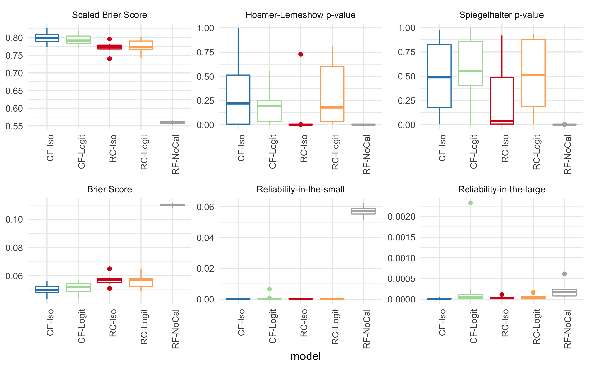

# CaliForest

**Cali**brated Random **Forest** - A Cloned Repository of the Calibrated Random Forest with Conformal Prediction

This Python package implements the CaliForest algorithm presented in [ACM CHIL 2020](https://www.chilconference.org/).

> **Note**: This is a cloned and enhanced version of the original CaliForest repository by Yubin Park, with additional features including Conformal Prediction (CP) capabilities.

You can use CaliForest almost the same way you used RandomForest i.e. you can just replace RandomForest with CaliForest.
The only difference would be that its predicted scores will be better calibrated than the regular RandomForest output, while maintaining the original predictive performance.
For more details, please see "CaliForest: Calibrated Random Forest for Health Data" in ACM Conference on Health, Inference, and Learning 2020. 



## Installing

Installing from the source:

```bash
$ git clone https://github.com/AI-Ahmed/califorest.git
$ cd califorest
$ pip install -e .
```

Or using uv (recommended for faster installation):

```bash
$ git clone https://github.com/AI-Ahmed/califorest.git
$ cd califorest
$ uv pip install -e .
```
Or directly install it

```bash
$ uv pip install git+https://github.com/AI-Ahmed/califorest.git
```

## Example Code

Training + Prediction:

```python
from califorest import CaliForest

model = CaliForest(n_estimators=100,
                    max_depth=5,
                    min_samples_split=3,
                    min_samples_leaf=1,
                    ctype="isotonic")

model.fit(X_train, y_train)
y_pred = model.predict_proba(X_test)[:,1]
```

Calibration metrics:

```python
from califorest import metrics as em

score_auc = roc_auc_score(y_test, y_pred)
score_hl = em.hosmer_lemeshow(y_test, y_pred)
score_sh = em.spiegelhalter(y_test, y_pred)
score_b, score_bs = em.scaled_Brier(y_test, y_pred)
rel_small, rel_large = em.reliability(y_test, y_pred)
```

## License

Apache License 2.0

## Contributors

- **Yubin Park** - Original author and creator of CaliForest
- **Ahmed Nabil Atwa** - Maintainer of this cloned repository with CP enhancements

## Reference

Y. Park and J. C. Ho. 2020. **CaliForest: Calibrated Random Forest for Health Data**. *ACM Conference on Health, Inference, and Learning (2020)*

## Original Repository

This repository is based on the original work by Yubin Park. The original repository can be found at: https://github.com/yubin-park/califorest
